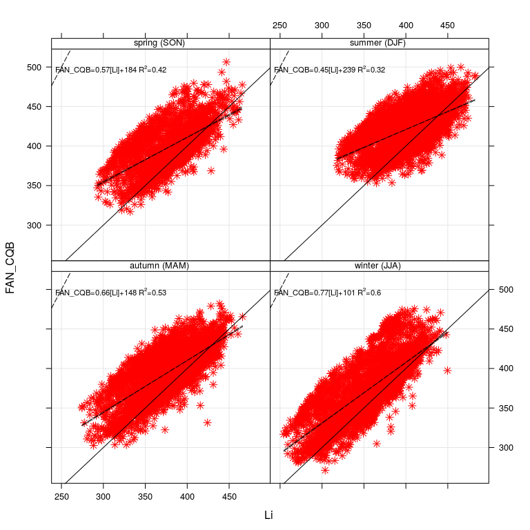
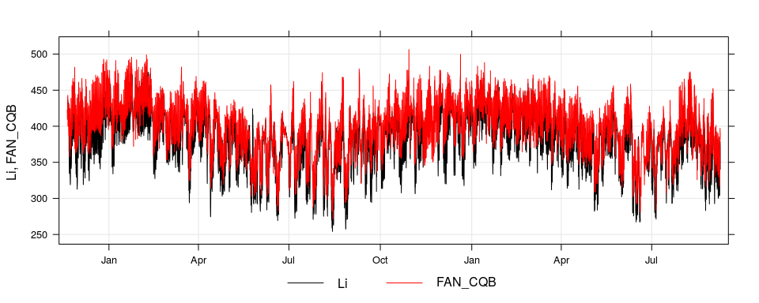
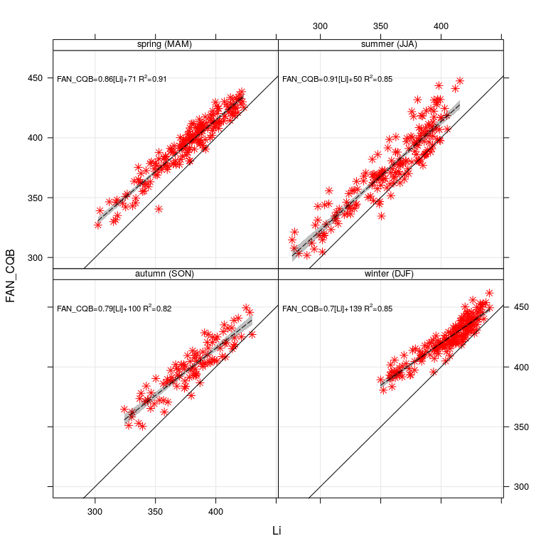
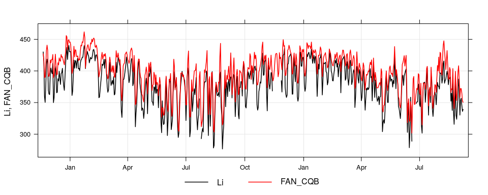
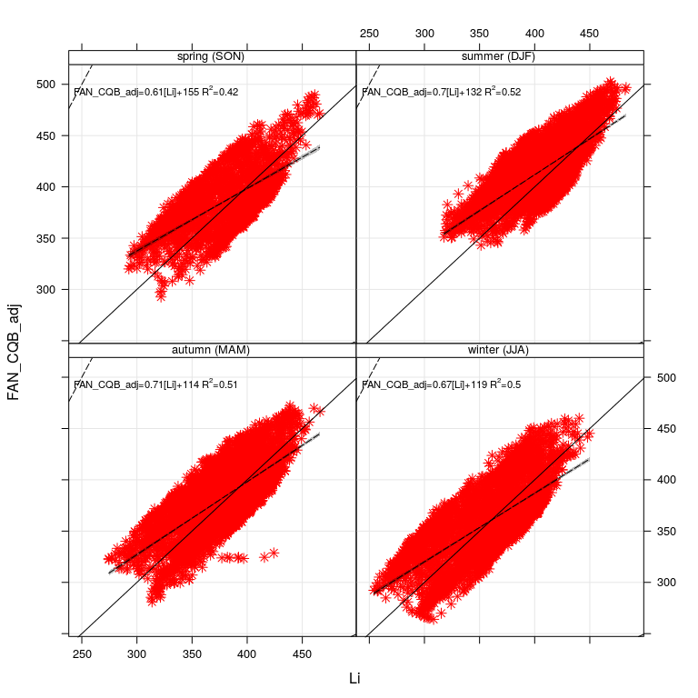
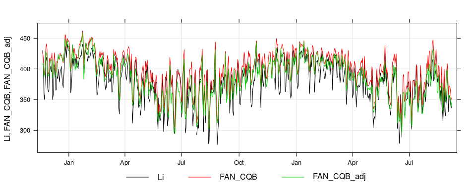

# longwaveR, a downward longwave radiation estimation R package.
Roilan Hernández Valdés  
October 9, 2016  


# Introduction

The incident longwave radiation (*Li*) is one of the essential components in the surface energy balance. It influences the balance of radiation, which determines the energy available to sensible and latent heat fluxes in surface. The *Li* can be determined with good accuracy from the moisture vertical profile, air temperature and other gases ($CO_2$, $CH_4$, $N_2O$) concentration in the atmosphere. But these data are not always available and therefore simpler methods have been developed based on more readily available measures, such as the temperature and humidity measured in meteorological stations. Several empirical expressions to estimate the emissivity of the atmosphere in clear sky conditions ($\epsilon_{ac}$) and cloud cover fraction ($C$) are available in the literature. However, when applied to regions different from those in which they were obtained, the uncertainty in the estimation increases.


# Transforming data


```r
    data_atmos <- 
    read_rds("../../BAGS/longwaveR_data.rds") %>%
    # Adding Potential Radiation in site (W/m2):
    mutate(Rpot = PotRad(date,lon=-53.76,lat=-29.72 )) %>%
    # Adding partial vapor water pressure (Pa):
    mutate(es = (rh/100) * (0.6112 * exp((17.67*Ta)/(243.5+Ta))) *10) %>%
    # Converting air temperature from C to K
    mutate(Ta = Ta+273.15) %>%
    # Ussing kloudines function to calculate the attenuation 
    # gobal radiation index 
    mutate(K = kloudines(Rg = Rg,dates = date,lon=-53.76,lat=-29.72 ))

    head(data_atmos) 
```

```
## Source: local data frame [6 x 8]
## 
##                  date       Rg       Ta       rh    Li     Rpot       es
##                (time)    (dbl)    (dbl)    (dbl) (dbl)    (dbl)    (dbl)
## 1 2013-11-20 00:00:00  0.00000 293.7669 93.08896    NA   0.0000 22.60014
## 2 2013-11-20 01:00:00  0.00000 293.5870 92.83499    NA   0.0000 22.28957
## 3 2013-11-20 02:00:00  0.00000 293.2014 93.85086    NA   0.0000 22.00245
## 4 2013-11-20 03:00:00  0.00000 293.1757 94.61277    NA   0.0000 22.14578
## 5 2013-11-20 04:00:00  0.00000 293.0729 94.61277    NA   0.0000 22.00510
## 6 2013-11-20 05:00:00 23.76502 293.1757 94.61277    NA 127.6601 22.14578
## Variables not shown: K (dbl)
```

# Getting a *Li* estimation


```r
    # Li calculated by FAN emissivity combined with CQB cloud cover scheme
    Li_sim <- get.Li(data = data_atmos, E_fun = "FAN", C_fun = "CQB") 
    # Observed and calculated Li:
    Li_sim_obs <- cbind(data_atmos %>% select(date,Li), Li_sim)
    head(Li_sim_obs[complete.cases(Li_sim_obs),])#%>% kable()
```

```
##                   date       Li  FAN_CQB
## 14 2013-11-20 13:00:00 435.6298 438.2344
## 15 2013-11-20 14:00:00 436.8293 441.3524
## 16 2013-11-20 15:00:00 433.7094 442.8125
## 17 2013-11-20 16:00:00 432.1021 438.6050
## 18 2013-11-20 17:00:00 431.7994 428.7865
## 19 2013-11-20 18:00:00 431.1240 400.2193
```

## Determining error

### Hourly data


```r
    scatterPlot(mydata = Li_sim_obs,
                x = "Li", y = "FAN_CQB",
                linear = TRUE,mod.line = TRUE,
                pch = 8, col = "red",
                type = "season", hemisphere = "southern"
                )
```




```r
    timePlot(mydata = Li_sim_obs,
             pollutant = c("Li","FAN_CQB"), 
             group = TRUE, 
             lty = 1, lwd = 1, 
             col = 1:2)
```




```r
    # Function for statistical analysis
    #   CalcStats
    CalcStats(data_li = Li_sim_obs,
          statistic = c("rmse","pbias","NSE","nrmse","rSD"),
          avg.time = "hourly") #%>% kable( )
```

```
## Source: local data frame [1 x 6]
## 
##   schemes     rmse pbias       NSE nrmse       rSD
##    (fctr)    (dbl) (dbl)     (dbl) (dbl)     (dbl)
## 1 FAN_CQB 30.72946   4.8 0.3329657  81.7 0.9349243
```

### Mean daily data


```r
    scatterPlot(mydata = Li_sim_obs,
                x = "Li", y = "FAN_CQB",
                linear = TRUE,mod.line = TRUE,
                pch = 8, col = "red",
                type = "season", hemisphere = "southern",
                avg.time = "day"
                )
```




```r
    timePlot(mydata = Li_sim_obs,
             pollutant = c("Li","FAN_CQB"), 
             group = TRUE, 
             lty = 1, lwd = 1.5, 
             col = 1:2,
             avg.time = "day")
```




```r
kable(CalcStats(data_li = Li_sim_obs,
          statistic = c("rmse","pbias","NSE","nrmse","rSD"),
          avg.time = "daily") )
```


schemes        rmse   pbias         NSE   nrmse         rSD
--------  ---------  ------  ----------  ------  ----------
FAN_CQB    20.80353     4.8   0.5759504    65.1   0.9579928

# Adjusting *Li* schemes coeficients


```r
    # Li calculated by FAN emissivity combined with CQB cloud cover scheme
    # ADJUSTING mode
    Li_sim_adj <- get.Li(data = data_atmos, E_fun = "FAN", C_fun = "CQB",
                         adjust = TRUE)
    names(Li_sim_adj) <- paste0(names(Li_sim_adj),"_adj")
    # Observed and calculated Li:
    Li_sim_obs_adj <- cbind(data_atmos %>% select(date,Li), Li_sim,Li_sim_adj)
    head(Li_sim_obs_adj[complete.cases(Li_sim_obs_adj),]) #%>% kable()
```

```
##                   date       Li  FAN_CQB FAN_CQB_adj
## 14 2013-11-20 13:00:00 435.6298 438.2344    423.5483
## 15 2013-11-20 14:00:00 436.8293 441.3524    422.7837
## 16 2013-11-20 15:00:00 433.7094 442.8125    415.9146
## 17 2013-11-20 16:00:00 432.1021 438.6050    412.5802
## 18 2013-11-20 17:00:00 431.7994 428.7865    408.7269
## 19 2013-11-20 18:00:00 431.1240 400.2193    405.8758
```


```r
    scatterPlot(mydata = Li_sim_obs_adj,
                x = "Li", y = "FAN_CQB_adj",
                linear = TRUE,mod.line = TRUE,
                pch = 8, col = "red",
                type = "season", hemisphere = "southern"
                )
```




```r
    timePlot(mydata = Li_sim_obs_adj,
             pollutant = c("Li","FAN_CQB","FAN_CQB_adj"), 
             group = TRUE, 
             lty = 1, lwd = 1, 
             col = 1:3, avg.time = "day")
```




```r
kable(CalcStats(data_li = Li_sim_obs_adj,
          statistic = c("rmse","pbias","NSE","nrmse","rSD"),
          avg.time = "hourly") )
```


schemes            rmse   pbias         NSE   nrmse         rSD
------------  ---------  ------  ----------  ------  ----------
FAN_CQB        30.72946     4.8   0.3329657    81.7   0.9349243
FAN_CQB_adj    26.07404     1.5   0.5197638    69.3   1.0294446

```r
kable(CalcStats(data_li = Li_sim_obs_adj,
          statistic = c("rmse","pbias","NSE","nrmse","rSD"),
          avg.time = "daily") )
```


schemes            rmse   pbias         NSE   nrmse         rSD
------------  ---------  ------  ----------  ------  ----------
FAN_CQB        20.80353     4.8   0.5759504    65.1   0.9579928
FAN_CQB_adj    17.66632     1.4   0.6942018    55.3   1.0016697


